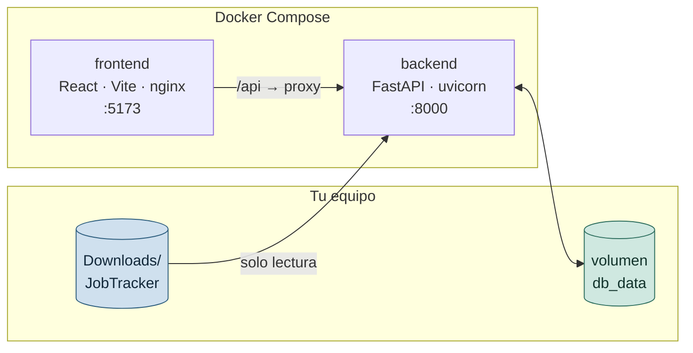

# Job Tracker

Pipeline local que convierte publicaciones de empleo scrapeadas en bruto en una
lista corta, ordenada y accionable de vacantes que valen tu tiempo — y después
te ayuda a seguir cada postulación hasta su desenlace.

De **1.017 publicaciones crudas** en una corrida real quedan **74 resultados**:
51 vacantes puntuadas y 23 publicaciones para revisar. El resto se descarta con
un motivo explícito en cada caso.

El proyecto es, en el fondo, un ejercicio de **procesamiento de datos**: ingesta
de fuentes heterogéneas y sucias, normalización a un esquema común,
deduplicación por identidad estable, clasificación, puntuación y persistencia
idempotente. La interfaz web es solo la última capa.

---

## Las dos piezas del sistema

La ingesta y el procesamiento viven en repositorios separados, a propósito:
scrapear es frágil y cambia cuando LinkedIn cambia su HTML; procesar no.

| | Repo | Rol |
|---|---|---|
| **1. Ingesta** | [job-scraper-extension](https://github.com/CarlosDev88/job-scraper-extension) | Extensión de Chrome que extrae ofertas de LinkedIn y Get on Board desde tu propia sesión y las guarda como `.json` |
| **2. Procesamiento** | este repo | Lee esos `.json`, los normaliza, deduplica, clasifica, puntúa y persiste |

El contrato entre ambos es deliberadamente simple: **una carpeta con archivos
JSON**. Ni API, ni base compartida, ni acoplamiento. La extensión escribe en
`Downloads/JobTracker/`; el pipeline lee de ahí en modo solo lectura.

Eso permite reprocesar el histórico completo cuantas veces quieras —
ajustando el perfil o los umbrales— sin volver a scrapear nada.

---

## El pipeline completo

```mermaid
flowchart LR
    subgraph ING["INGESTA · extensión de Chrome · repo aparte"]
        direction TB
        A1["LinkedIn<br/>Empleos · Publicaciones · Feed"]
        A2["Get on Board"]
    end

    A1 & A2 --> RAW[("Downloads/JobTracker<br/>*.json")]
    RAW -->|"volumen :ro"| P1

    subgraph PIPE["PROCESAMIENTO · POST /pipeline/filtrar"]
        direction LR
        P1["1 · EXTRACCIÓN<br/>detectar fuente<br/>parsear por archivo"]
        P2["2 · NORMALIZACIÓN<br/>esquema común<br/>sanear nulls y surrogates"]
        P3["3 · IDENTIDAD<br/>canonicalizar link<br/>dedupe_key SHA-256"]
        P4{"4 · CRIBADO<br/>lista negra<br/>intención del post"}
        P5{"5 · PUNTUACIÓN<br/>zonas duro/blando<br/>vetos y señales"}
        P6["6 · DEDUPLICACIÓN<br/>clave exacta<br/>+ reposts similares"]

        P1 --> P2 --> P3 --> P4
        P4 -->|"OFERTA"| P5
        P5 -->|"score ≥ 20"| P6
        P4 -->|"INDETERMINADO<br/>sin puntuar"| P6
    end

    P4 -.->|"candidato · ruido<br/>empresa vetada"| DESC(["descartadas<br/>con motivo en stats"])
    P5 -.->|"veto duro · score &lt; 20"| DESC

    P6 --> DB[("SQLite · resultados<br/>UPSERT · histórico")]
    P6 --> JSON[("filtradas.json<br/>snapshot atómico")]
    DB --> API["API<br/>filtros y paginación<br/>server-side"]
    API --> UI["Dashboard"]
    UI -->|"guardar<br/>aplicar"| TRACK[("SQLite · job_applications<br/>estados · fechas · notas")]

    classDef almacen fill:#cfe8e0,stroke:#2f6f5f,color:#12332b
    classDef entrada fill:#cfe0ee,stroke:#2f5f7f,color:#12283a
    classDef descarte fill:#f0d4d4,stroke:#9b4141,color:#3f1616
    class DB,JSON,TRACK almacen
    class RAW entrada
    class DESC descarte
```



---

## Cómo se procesan los datos crudos

Cada etapa existe porque los datos reales rompen algo. Lo que sigue explica
qué problema resuelve cada una.

### 1 · Extracción

**El problema:** cuatro fuentes, cuatro formatos, y ninguno garantiza nada.

La fuente se deduce del **nombre del archivo** (`getonbrd_*`,
`linkedin_feed_*`, `linkedin_publicaciones_*`, `linkedin_*`), porque el
contenido no siempre la delata. Cada archivo se parsea de forma independiente
dentro de un `try/except`: un JSON truncado registra su error en `stats` y el
resto continúa. Se aceptan tanto una lista suelta como un objeto
`{"vacantes": [...]}`.

### 2 · Normalización

**El problema:** un post del feed y una vacante de Get on Board no se parecen
en nada, pero después de aquí tienen que ser comparables.

Todo se mapea a un esquema único: `titulo`, `empresa`, `ubicacion`,
`descripcion`, `link`, `imagenes`, `contactos`. Los posts del feed que traen una
tarjeta de empleo embebida se promueven a `vacante`; los demás se evalúan como
`feed_post`, con su propia escala.

Dos defensas que no son opcionales con datos reales:

- **`null` no es lo mismo que ausente.** El scraper emite `"empresa": null`, y
  `dict.get(clave, "")` devuelve `None` en ese caso, no `""`. Un solo registro
  así rompía el pipeline completo.
- **Surrogates sueltos.** Los emojis mal codificados de LinkedIn producen
  caracteres que ni SQLite ni `json.dump` aceptan. Se sanean antes de persistir.

### 3 · Identidad

**El problema:** la misma vacante aparece varias veces con URLs distintas. Sin
una identidad estable no hay deduplicación posible.

El `link` se canonicaliza: se eliminan parámetros de tracking (`utm_*`, `trk`,
`refId`), se colapsa `/jobs/view/<id>` a su forma mínima y se descartan
esquemas que no sean `http(s)`.

De ahí sale la **`dedupe_key`**, un SHA-256 de:

- el link canonicalizado, **si identifica la vacante**; o
- `título + empresa + primeros 1.000 caracteres de la descripción`, si no hay
  link o si el que hay es un perfil de persona.

Esa última salvedad importa: cuando un aviso no trae URL propia, el scraper
guarda el perfil del autor. Tomar eso como identidad hacía que **todas las
vacantes de un mismo reclutador colapsaran en una sola**.

La fuente **no** entra en la clave: la misma vacante vista en la búsqueda de
empleos y en una publicación suelta debe ser un único registro.

### 4 · Cribado

**El problema:** la mitad de lo que parece una oferta no lo es.

Un candidato escribiendo *"looking for a new opportunity as React developer"*
usa el mismo vocabulario técnico que una oferta real. Distinguirlos por stack es
imposible; hay que mirar **quién habla y hacia dónde apunta la búsqueda**.

`detectar_intencion()` cuenta señales en tres categorías:

| Categoría | Señales | Resultado |
|---|---|---|
| `OFERTA` | *estamos buscando*, *we're hiring*, *envía tu CV a* | sigue a puntuación |
| `CANDIDATO` | *#OpenToWork*, *busco empleo*, *mi hoja de vida* | descartada |
| `RUIDO_SOCIAL` | *feliz cumpleaños*, *aniversario laboral*, *me uno a* | descartada |
| `INDETERMINADO` | sin señal clara, o empate | **no se puntúa** |

El caso `INDETERMINADO` es el interesante. Ante la duda, el sistema **no
adivina**: no descarta (perdería vacantes reales) ni puntúa (un número
inventado sobre una clasificación insegura es peor que ninguno). Marca el
registro como *Revisar* con `score = null` y lo aparta en un filtro propio.

Esto solo se aplica a `linkedin_publicaciones`, que son posts sueltos. Los
listados de empleo reales no necesitan la comprobación.

### 5 · Puntuación

**El problema:** *"deseable: Kubernetes"* y *"requisito indispensable:
Kubernetes"* significan cosas opuestas, y ambas contienen la misma palabra.

Antes de puntuar, la descripción se parte en **zonas** según sus cabeceras:

- `DURO` — *requisitos*, *indispensable*, *excluyente*, *must have*
- `BLANDO` — *deseable*, *nice to have*, *plus*, *beneficios*

Cada keyword se evalúa según la zona donde cae. Un veto en zona dura descarta la
vacante; en zona blanda solo se anota como carencia. Una mención en el **título**
siempre cuenta como dura.

**Vetos** (descartan sin puntuar): stack incompatible en zona dura, inglés
avanzado exigido, o presencial/híbrido fuera de tu ciudad base.

**Suma de señales:**

| Señal | Peso |
|---|---|
| Tecnología core en el título | +15 c/u (máx. 30) |
| Tecnología core en zona dura | +8 |
| Tecnología secundaria | +3 |
| Bonus de dominio (e-commerce, performance) | +5 |
| Keyword de tu perfil | +5 |
| Keyword excluida de tu perfil, en zona dura | −30 |
| 3–4 años de experiencia | +5 |
| 6+ años de experiencia | −10 |
| Remoto en LATAM/Colombia | +5 |
| Base, por no exigir inglés avanzado | +5 |

El resultado se recorta a `0–100` y se traduce en una decisión:

| Score | Decisión |
|---|---|
| ≥ 55 | `APLICAR_YA` |
| ≥ 35 | `APLICAR` |
| ≥ 20 | `REVISAR_MANUAL` |
| < 20 | descartada |

Las **publicaciones del feed** usan una escala aparte, más laxa y no comparable:
primero deben mostrar señal de contratación *y* una vía de contacto (email,
`lnkd.in`, *envía tu CV*), y luego se puntúan como `REVISAR` (≥ 4) o `TAL_VEZ`
(≥ 1). Nunca se mezclan con el porcentaje de las vacantes.

### 6 · Deduplicación

Dos pasadas, porque hay dos clases de duplicado:

**Exacto** — misma `dedupe_key`. Sobrevive el registro más completo, decidido
por: tiene link → más imágenes → descripción más larga → mayor score.

**Reposts** — el mismo aviso republicado con otra referencia interna. Se agrupa
por empresa normalizada y se colapsa en dos pasos:

1. Coincidencia exacta de `título sin REF# + primeros 300 caracteres`.
2. Similitud de descripción ≥ **0,85** (`difflib.SequenceMatcher`) entre lo que
   quedó.

En datos reales esto fusiona ~56 registros por corrida.

### 7 · Persistencia

Dos destinos con propósitos distintos:

**SQLite (`resultados`)** — histórico acumulado. La escritura es un `UPSERT`
sobre `dedupe_key UNIQUE`: si el aviso ya existía se actualiza en su sitio y
conserva su `primera_vez` original. Reprocesar los mismos JSON no duplica ni una
fila, así que la operación es **idempotente**.

**`filtradas.json`** — snapshot de la última corrida, con `stats` y errores por
archivo. Se escribe de forma atómica (`tmp` → `fsync` → `os.replace`), así que
nunca queda a medias.

El orden importa: primero se guarda, después se purgan las empresas bloqueadas.
Al revés, un fallo al guardar dejaría el histórico borrado y sin reemplazo.

### 8 · Consumo

Los filtros y la paginación se resuelven **en el backend**, no en el navegador:
el histórico crece indefinidamente y mandarlo entero al cliente deja de escalar
rápido. Cada pestaña mantiene su propio estado de filtros.

Guardar una vacante la copia a `job_applications`, que es una tabla
independiente: **el seguimiento sobrevive a cualquier reprocesamiento**.

---

## Arquitectura



**Backend** — Python 3.12, FastAPI, SQLite. Sin ORM ni dependencias de más: el
pipeline es la biblioteca estándar y la persistencia es `sqlite3` directo.

**Frontend** — React 18 + Vite, Tailwind con tokens CSS para temas claro/oscuro,
servido por nginx que hace de proxy hacia el backend.

Ambos puertos se publican **solo en `127.0.0.1`**.

### Estructura

```
backend/
  main.py                 endpoints HTTP
  pipeline.py             orquestación del pipeline
  database.py             esquema, consultas y migraciones
  filtros/
    normalizador.py       fuentes heterogéneas → esquema común
    texto.py              canonicalización, dedupe_key, saneado
    intencion.py          OFERTA / CANDIDATO / RUIDO_SOCIAL
    keywords.py           zonificación, vetos y puntuación
    feed_filter.py        escala aparte para posts del feed
frontend/src/
  pages/                  Dashboard · Seguimiento · Perfil
  components/             badges de score y decisión
tests/
  test_v1.py              lógica pura
  test_api.py             endpoints HTTP
respaldo.sh               respaldo y restauración de la base
```

### Modelo de datos

| Tabla | Qué guarda | Ciclo de vida |
|---|---|---|
| `perfiles` | Keywords, CV, ubicación base, empresas bloqueadas | Lo editas tú |
| `resultados` | Histórico de todo lo procesado | Se acumula; upsert por `dedupe_key` |
| `job_applications` | Tus postulaciones: estado, fechas, notas | **Solo tú lo borras** |

`resultados.score` es *nullable* a propósito: `NULL` significa «no se puntuó,
requiere revisión humana», que es distinto de un cero.

### API

| Endpoint | Qué hace |
|---|---|
| `POST /pipeline/filtrar` | Ejecuta el pipeline completo |
| `GET /pipeline/estado` | Metadatos de la última corrida (sin las listas) |
| `GET /resultados` | Resultados con filtros y paginación server-side |
| `GET /resultados/conteos` | Totales por tipo y pendientes de revisar |
| `GET·POST·PUT·DELETE /aplicaciones` | Seguimiento de postulaciones |
| `GET·PUT /perfil` | Configuración del perfil activo |

---

## Puesta en marcha

### Requisito previo: la carpeta de datos

El pipeline **no descarga nada por sí mismo**: lee los JSON que deja la
[extensión de Chrome](https://github.com/CarlosDev88/job-scraper-extension). Para
el flujo completo necesitas esa extensión instalada y al menos una extracción
hecha.

| Sistema | Ruta a crear |
| --- | --- |
| Windows | `C:\Users\TU_USUARIO\Downloads\JobTracker` |
| WSL | `/mnt/c/Users/TU_USUARIO/Downloads/JobTracker` |
| macOS | `/Users/TU_USUARIO/Downloads/JobTracker` |
| Linux | `/home/TU_USUARIO/Downloads/JobTracker` |

Se monta en `/app/raw_data` **en modo solo lectura**: el proyecto nunca modifica
ni borra tus descargas.

### Arranque

```bash
cp .env.example .env     # PowerShell: Copy-Item .env.example .env
```

Edita `RAW_DATA_HOST_PATH` con tu ruta. Es el único valor que cambia entre
sistemas operativos:

```ini
# Windows (Docker Desktop) — barras normales "/", Docker las traduce
RAW_DATA_HOST_PATH=C:/Users/TU_USUARIO/Downloads/JobTracker

# WSL
RAW_DATA_HOST_PATH=/mnt/c/Users/TU_USUARIO/Downloads/JobTracker

# macOS / Linux
RAW_DATA_HOST_PATH=/Users/TU_USUARIO/Downloads/JobTracker
```

> **Al migrar de WSL a Windows nativo:** la ruta `/mnt/c/...` solo funciona
> dentro de WSL. Con Docker Desktop debe ser `C:/Users/...`, o el volumen se
> monta vacío y verás *"No hay archivos JSON en /app/raw_data"*.

```bash
docker compose up --build
```

Abre <http://localhost:5173> y pulsa **Procesar JSON**.

### Uso

1. La extensión deja los `.json` en `Downloads/JobTracker`.
2. **Procesar JSON** ejecuta el pipeline y actualiza el ranking.
3. **Vacantes** trae lo puntuado; **Publicaciones**, los posts del feed.
4. *Guardar* o *Guardar como aplicada* mueven la vacante a Seguimiento.
5. En **Seguimiento** gestionas estado, fechas y notas.

### Vetar empresas

En **Perfil → Empresas bloqueadas**, separadas por coma. Sus vacantes se
descartan al procesar y las ya guardadas se purgan del histórico en esa misma
corrida.

No hace falta el nombre exacto: `bairesdev` reconoce también `Baires Dev`,
`BairesDev LLC` y `BAIRESDEV S.A.` El nombre debe coincidir como palabra
completa, así que bloquear `HP` no afecta a una vacante de `PHP`.

### Formato mínimo de entrada

```json
{
  "titulo": "Senior Frontend Engineer",
  "empresa": "Acme",
  "ubicacion": "Colombia remoto",
  "descripcion": "Requisitos: React y TypeScript...",
  "link": "https://www.linkedin.com/jobs/view/123"
}
```

Los archivos pueden ser una lista o un objeto con la propiedad `vacantes`. El
feed de LinkedIn admite además su formato con `tarjeta_empleo`.

---

## Respaldo

La base vive en el volumen Docker `db_data`. Ahí está lo único que no se
recupera volviendo a scrapear: **a qué aplicaste, cuándo, en qué estado va y tus
notas**.

> El volumen sobrevive a `docker compose down`, pero **no a
> `docker compose down -v`**: esa bandera lo borra sin preguntar.

```bash
./respaldo.sh                                  # crea respaldos/job_tracker_AAAAMMDD_HHMMSS.db
./respaldo.sh listar
./respaldo.sh restaurar respaldos/ARCHIVO.db   # pide confirmación
```

Usa la API de respaldo de SQLite en vez de copiar el archivo: con WAL activo una
copia suelta puede quedar incompleta. Al restaurar se guarda primero la base
actual, por si el respaldo estuviera dañado.

`respaldos/` está en `.gitignore`. Tampoco se versionan `.env`, `raw_data/` ni
`filtradas/`.

---

## Tests

Cubren la lógica pura (normalización, deduplicación, identidad, puntuación,
lista negra) y los endpoints HTTP. No necesitan levantar el proyecto:

```bash
docker run --rm -v "${PWD}:/app" -w /app python:3.12-slim \
  bash -c "pip install -q -r backend/requirements-dev.txt && python -m pytest tests -v"
```

Con Docker encendido, `./verificar.sh` comprueba que los servicios responden.

Los scripts `.sh` requieren un shell tipo bash. En Windows usa **Git Bash** o
**WSL**.

---

## Seguridad

Los puertos se publican solo en `127.0.0.1`, así que el backend no es alcanzable
desde otras máquinas de la red. Esto importa porque **no hay autenticación**: la
base guarda tu CV y tu historial de postulaciones.

Si cambias el mapeo de puertos en `docker-compose.yml` o el `host` en
`frontend/vite.config.js`, estarías exponiendo esos datos a cualquiera en la
misma red.

---

## Nota sobre el scraping

La extensión automatiza clics y scroll dentro de tu propia sesión del navegador.
Aun así, el scraping automatizado va en contra de los términos de servicio de
LinkedIn y Get on Board. Úsalo con moderación.
